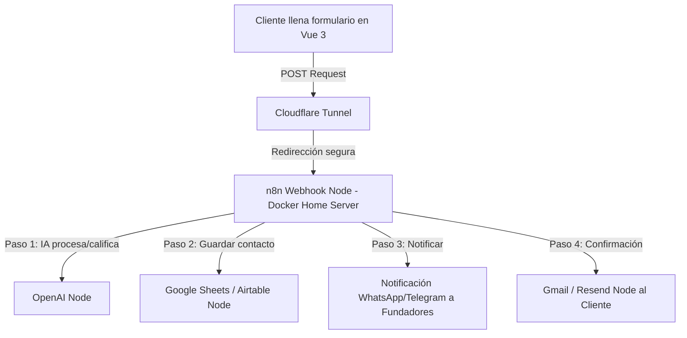

# Propuesta Estratégica: We Are Samod 🚀
*Agencia de Automatizaciones con Inteligencia Artificial para PYMEs*

¡Felicitaciones por el emprendimiento! Formar una agencia de automatización con IA en Chile, y específicamente apuntando al mercado local de **Los Ángeles (Región del Biobío)**, es una excelente oportunidad. Las PYMEs locales necesitan digitalizarse, ahorrar tiempo y competir mejor, pero muchas veces no tienen la capacidad técnica ni el presupuesto para grandes desarrollos a medida.

A continuación, les presentamos una estrategia recomendada para estructurar su propuesta de valor, su arquitectura técnica y el diseño de su **Landing Page**.

---

## 1. ¿Deberían hacer una Landing Page? ¡Absolutamente Sí! 🌐

Para vender servicios B2B (de empresa a empresa) y especialmente de tecnología avanzada como la IA, una **landing page profesional no es opcional, es su carta de presentación y su principal herramienta de ventas.**

### ¿Por qué es crucial para We Are Samod?
1. **Generación de Confianza:** Las PYMEs locales suelen ser escépticas con la "Inteligencia Artificial" si suena abstracta. Una web profesional demuestra que son una empresa seria y constituida.
2. **Educación al Cliente:** La mayoría de los dueños de negocios no saben qué es `n8n` ni cómo un "agente de IA" les ayuda. La landing page debe traducir los conceptos técnicos a **beneficios de negocio** (ej. *"Ahorra 10 horas semanales en responder WhatsApps"*).
3. **Captación de Leads (Clientes Potenciales):** Su landing page debe estar optimizada para que un interesado agende una llamada de diagnóstico gratuita (ej. usando Calendly o TidyCal).
4. **Diferenciación Local:** Al estar en Los Ángeles, Chile, pueden destacar el soporte local, la cercanía y la adaptabilidad al mercado chileno (ej. integración con WhatsApp, pasarelas de pago locales, boletas/facturas electrónicas).

---

## 2. Estructura de la Landing Page Recomendada 🎯

No necesitan un sitio web gigante de 20 páginas. Una estructura de **One-Page** (Landing Page única) altamente optimizada es lo ideal para empezar:

| Sección | Contenido / Enfoque | Objetivo |
| :--- | :--- | :--- |
| **1. Hero Section** | Título de alto impacto. Ej: *"Automatizamos las tareas repetitivas de tu negocio con Inteligencia Artificial"* + Subtítulo enfocado en PYMEs en Los Ángeles/Chile. | Capturar la atención en 3 segundos y retener al usuario. |
| **2. El Problema** | ¿Pierdes tiempo respondiendo las mismas preguntas en WhatsApp? ¿Tus cotizaciones tardan días? ¿Problemas de registro? | Empatizar con el dolor del dueño de la PYME. |
| **3. La Solución** | Explicar sus servicios de forma visual y sencilla: Agentes de WhatsApp, Automatización de Facturas/SII, Sincronización de Inventarios, y Gestión de Reseñas. | Demostrar que tienen la cura para su dolor. |
| **4. Casos de Uso / Demos** | Un simulador interactivo de chat que muestre, por ejemplo, cómo responde el agente inteligente a escenarios comunes del negocio en tiempo real. | Mostrar, no solo contar (crucial para IA). |
| **5. Quiénes Somos** | Perfil de los co-fundadores e integración de su propio Agente Autónomo de Soporte virtual. Resaltar que son profesionales locales de la Región del Biobío. | Generar confianza humana y demostrar el uso de sus propios agentes. |
| **6. CTA / Contacto** | Formulario simple o botón para *"Agendar Auditoría de Procesos Gratis (15 min)"*. | Conversión rápida. |

---

## 3. Arquitectura Técnica: ¿Vite + Vue 3 o Django? 🛠️

Para una agencia de automatizaciones, la combinación **Vite + Vue 3 (Frontend) + n8n (Backend/Motor de automatización)** es superior a usar Django. He aquí el porqué:

### Comparativa: Vue 3 + n8n vs Django

| Criterio | Django | Vite + Vue 3 + n8n (Recomendado) |
| :--- | :--- | :--- |
| **Complejidad de Código** | Alta (modelos, migraciones, vistas, SMTP, bases de datos). | Muy baja (solo frontend estático reactivo). |
| **Gestión de Formularios** | Python/Django (requiere configurar servidor SMTP en código). | **n8n Webhook Node**: Recibe el formulario y envía correos/notificaciones sin escribir backend. |
| **Panel de Administración** | Django Admin (rígido pero útil). | **Airtable / Google Sheets / CRM** conectados a n8n (flexible, visual y fácil de configurar). |
| **Casos de Demostración** | Difícil de integrar con flujos asíncronos complejos. | Ideal para crear componentes interactivos (ej. simulador de chat de IA). |
| **"Dogfooding"** | No demuestra tus habilidades de automatización. | **Demuestra tu producto**: El formulario de contacto de tu web corre sobre el mismo n8n que vendes a tus clientes. |

### Flujo de Datos Recomendado con n8n:

### Contenedores y Aislamiento en Docker:
Como ya trabajan con contenedores Docker, la landing page en **Vite + Vue 3** se puede empaquetar de forma ultra-limpia:
1. **Compilación Multietapa (Multi-stage Build):** Un contenedor Docker compila el sitio de Vue con Node y un segundo stage ligero con **Nginx** sirve el contenido estático compilado en milisegundos.
2. **Aislamiento absoluto:** Se monta junto a sus otros contenedores en su `docker-compose` o se despliega de forma independiente, comunicándose solo por HTTPS (vía Cloudflare Tunnel) hacia el contenedor de `n8n` cuando se envía el formulario.

---

## 4. Oportunidades de Negocio en Chile (Servicios Estrella) 🇨🇱

Para las PYMEs en Chile, el valor real de la IA no está en escribir poemas, sino en resolver problemas operativos reales. Estos son los 3 servicios con mayor demanda y más fáciles de implementar usando `n8n` e IA:

1. **Agentes de WhatsApp Inteligentes:**
   - **El dolor:** Negocios locales (restaurantes, centros de estética, tiendas de e-commerce, constructoras) pierden clientes porque tardan horas en responder WhatsApp.
   - **La solución:** Un agente de IA conectado a WhatsApp (usando Evolution API o Z-API integrados con n8n y OpenAI/Claude) que responda preguntas frecuentes sobre precios, stock, horarios, y que además agende citas directo en Google Calendar.
2. **Automatización de Administración y Facturación (SII):**
   - **El dolor:** Procesar facturas de proveedores manualmente, subirlas al sistema de contabilidad o a un Google Sheet.
   - **La solución:** n8n descarga PDFs de facturas desde un correo electrónico, extrae los datos usando IA (OCR inteligente como GPT-4o-mini) y los clasifica en un dashboard de control de gastos.
3. **Automatización de Ventas y CRM:**
   - **El dolor:** Los leads que llegan por Facebook/Instagram Ads se quedan en el aire y nadie los contacta.
   - **La solución:** Sincronizar los leads con un CRM básico (ej. HubSpot, Kommo) y gatillar mensajes automáticos personalizados por WhatsApp al instante.
4. **Automatización de Reseñas de Google (Posicionamiento SEO Local):**
   - **El dolor:** Locales con atención física (restaurantes, centros de estética, clínicas, tiendas) pierden posicionamiento en Google Maps porque los clientes rara vez dejan reseñas, o las quejas no se gestionan en privado a tiempo.
   - **La solución:** Tras completar un servicio o venta (POS/CRM), nuestro agente envía un WhatsApp amigable pidiendo feedback. Si la experiencia es positiva, enlaza a Google Maps; si es regular, abre una encuesta interna de soporte privado. El agente de IA responde además automáticamente cada nueva reseña en tiempo real.

---

## 5. Próximos Pasos Sugeridos 🚀

1. **Definir la propuesta de valor inicial:** ¿En qué se van a enfocar primero? (Nuestra recomendación: **Automatización de WhatsApp y Agendamiento**).
2. **Crear la Landing Page:** Podemos desarrollar un sitio web responsivo, moderno, elegante y rápido directamente aquí.
3. **Conectar la Landing con n8n:** Configurar el formulario de contacto para que envíe los datos a su servidor y experimenten su primera automatización en vivo.
